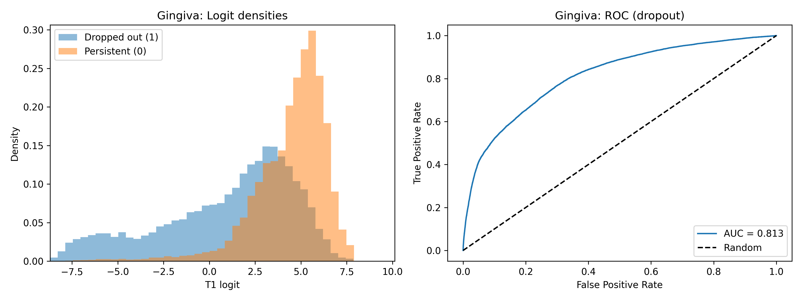
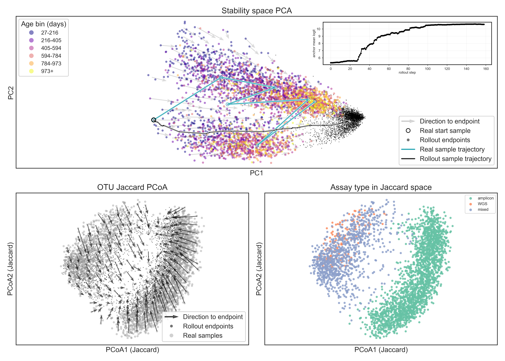

# Microbiome Model

This repo contains a transformer-based microbiome representation model plus evaluation scripts for multiple downstream tasks.

## Install with `uv`

```bash
uv sync
```

Run scripts with:

```bash
uv run python <script_path.py>
```

## Data location

- Local data root: `data/`
- Temporary download link (replace with real URL): `https://TEMP-DATA-LINK.example.com`

## Main evaluation scripts

- `run_main_evals.sh`: runs the core zero-shot evaluations and prediction tasks.
- `run_mlp_baselines.sh`: runs MLP baselines for key datasets.

From repo root:

```bash
bash run_main_evals.sh
bash run_mlp_baselines.sh
```

Example main-evals visual (`gingivitis_dropout_density_roc_base.png`):



## Model location

- Architecture: `model.py`
- Shared loading/config paths: `scripts/utils.py`
- Default checkpoint path referenced by scripts: `data/model/checkpoint_epoch_0_final_newblack_2epoch_notextabl.pt`

## What the model does

The model embeds sets of microbiome OTUs into a latent representation and supports downstream tasks including:

- Zero-shot dropout prediction
- Zero-shot colonisation prediction
- IBS cross-country prediction
- Infant environment prediction
- Comparative rollout trajectory analysis/visualization

## Training overview

### Representations

We embed SSU rRNA sequences using a DNA language model (ProkBERT) to obtain fixed-dimensional vectors without learned OTU IDs. We use ~100,000 SSU rRNA representative sequences (OTU level: 97%) from the MicrobeAtlas MAPseq reference database.

We explored two denoising-set variants:

- DNA-only: consumes only SSU rRNA embeddings.
- DNA+text: optional free-text metadata (biome, host, technology) encoded with `text-embedding-3-small` and concatenated as in-context tokens.

Unless explicitly noted, main results are reported for the DNA-only variant, which performed slightly better on average across evaluations.

### Negative generation

For each sample `x_i` with observed OTUs `S_i`, we construct a corrupted set `S'_i` by adding imposter OTUs that are relatively close in SSU-rRNA-embedding space.

Operationally:

- Build a pool of minimum-similarity OTUs for `S_i` using cosine similarity on L2-normalized SSU-rRNA embeddings.
- Remove OTUs already in `S_i`.
- Sample approximately `r * |S_i|` imposters (`r = 33%`) and add them:
  `S'_i ≈ S_i ∪ {within-minimum-cosine imposters of size ≈ r|S_i|}`.

The minimum cosine cutoff is varied uniformly, producing negatives with varying difficulty. Metadata tokens, when present, are left unchanged.

Figure: imposter pool creation and selection strategy.


### Model and objective

For each sample, inputs are DNA embeddings from `S'_i = S_i ∪ N_i` (true-present OTUs plus imposters), and optional text embeddings `T_i` in the DNA+text variant.

- Inputs are mapped into a shared `d`-dimensional space with type-specific linear layers.
- A Transformer encoder is applied without positional encodings, yielding permutation invariance over OTU sets.
- Text embeddings (if used) act only as context through self-attention.
- A small output head produces one logit per DNA embedding (high for true-present OTUs, low for imposters).
- Training uses class-balanced binary cross-entropy, normalizing positive and negative contributions separately.

## DIABIMMUNE one-out-one-in anchored visualization

Script:

- `scripts/rollout/plot_diabimmune_oneoutoneinanchored_trajectory_overlay.py`

Run:

```bash
uv run python scripts/rollout/plot_diabimmune_oneoutoneinanchored_trajectory_overlay.py
```

Output figure:

- `data/rollout_metropolis/diabimmune_rollout_trajectory_overlay_oneoutoneinanchored.png`

Visualization:



What this figure shows:

- Top panel (PCA): real DIABIMMUNE samples (age-coloured), rollout endpoints (grey), and arrows from each start to its endpoint. The inset tracks anchor mean logit over rollout steps for the highlighted example.
- Bottom-left (Jaccard PCoA): the same rollout displacement pattern in OTU-set similarity space, confirming convergence in community membership space (not only embedding geometry).
- Bottom-right (instrument-coloured): the same Jaccard coordinates coloured by sequencing technology (HiSeq/MiSeq/mixed), showing how technology-separated regions are pulled toward nearby stable endpoints.

Interpretation: under one-out-one-in anchored updates, communities tend to move toward local attractor-like stable profiles learned by the model.
